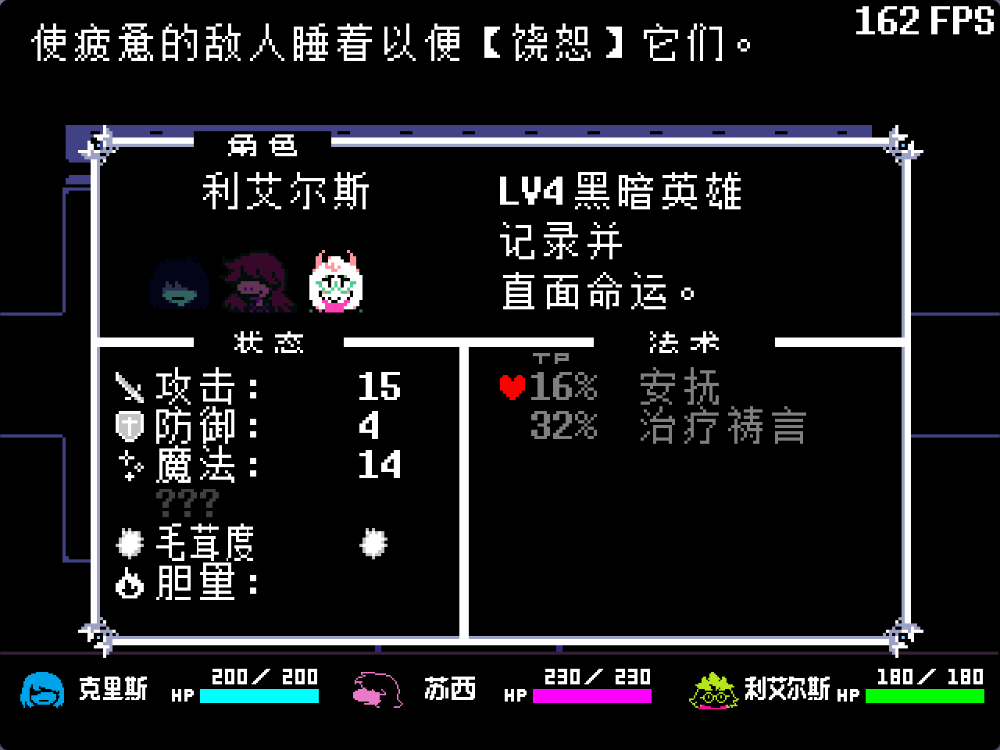
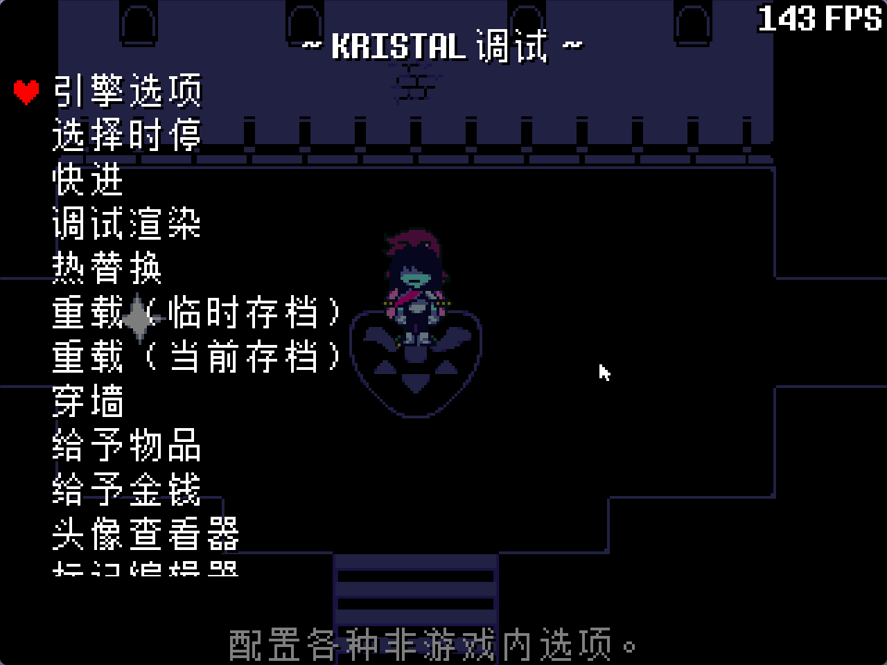

# kristal-i18n

[](LICENSE-APACHE)
<br>


<details>
<summary>更多截图（存档页面 / 角色能力 / 调试界面 / 光世界背包）</summary>







</details>

**kristal-i18n** — Kristal 的多语言本地化库，内置英文与简体中文。

| 简体中文 | English |
|---------|---------|
| 简体中文 | [English](./README_en.md) |

## 怎么用

三步，完事儿：

**1. 把库装上**

把 `libraries/kristal-i18n` 整个目录放进你的模组：

```text
mods/your_mod/libraries/kristal-i18n/
```

**2. 写 JSON**

在模组里建 `lang/<语言>.json`，把要翻译的文本写上：

```json
{
    "room1.hello": "* 你好！"
}
```

**3. 弄个花括号**

在代码里用 `{key}` 引用它：

```lua
cutscene:text("{room1.hello}")
```

完事儿。玩家可以在游戏内**设置菜单**中切换语言（默认 `en` / `zh_hans`）。

除了花括号，也可以直接调用 `Game:loc`：

```lua
Game:loc("room1.hello")                    -- 查表
Game:loc("room1.hello", {name = "Kris"})   -- 带变量
```

> ⚠️ **API 与原版 LangLib 不兼容**：`Game:loc` 第一个参数永远是 ID，不接受 LangLib 的 `Game:loc("fallback", "id")` 写法。缺失 ID 会显示红色错误标记。

## 更多技巧

- **角色名**：`lang/names.json` 里按语言给名字，文本中用 `[name:kris]` 引用
- **Tiled 对话**：NPC/Interactable 的 `text1`、`text2` 属性直接写 `{key}`
- **选项**：`cutscene:choicer({"{choice.yes}", "{choice.no}"})`
- **变量**：文本里写 `[var:name]`，调用时传 `Game:loc("key", {name = "Kris"})`
- **混合文本**：`cutscene:text("* {name_susie} threw a punch!")` —— 只有花括号里的部分会被翻译
- **资源覆盖**：字体、贴图、音频放 `lang/<语言>/...` 路径即可自动按语言切换

## 配置

默认配置在 `lib.json`，也可在模组的 `mod.json` 中覆盖：

```json
"config": {
    "kristalI18n": {
        "defaultLanguage": "auto",
        "languages": ["en", "zh_hans"],
        "languageNames": {
            "en": "English",
            "zh_hans": "简体中文"
        },
        "languageToggleKey": "f7",
        "cjkFixedTextSpacing": 4,
        "cjkDialogueTextSpacing": 4,
        "cjkDialogueYOffset": -1,
        "cjkTypewriterSpeedMultiplier": 1
    }
}
```

- `defaultLanguage` — 具体语言 ID 或 `"auto"`（自动检测系统语言并匹配最佳可用语言）；名称语言与文本语言独立
- `languageToggleKey` — 快捷切换语言的按键；`false` 可禁用
- `cjk*` — 中文排版微调：字符间固定字间距、对话字间距与垂直偏移、打字机速度倍率。本库为中文特意做了这些调整（英文无需），如需适配其他 CJK 语言或修改观感可覆盖

## 上游来源与参考

本库的 hook 骨架与预置 ID 模式继承自 GameBanana 的 [LangLib](https://gamebanana.com/mods/627141)（API 不兼容，见上文警告），并参考了以下汉化项目：

本库内置的中文贴图使用了 [好人汉化组（Goodman 3 Localization Group | UNDERTALE & DELTARUNE Chinese Localization）](https://github.com/gm3dr/) 的贴图。

| 项目 | 作者/组织 |
|------|-----------|
| [LangLib](https://gamebanana.com/mods/627141) | Elioze |
| [DELTARUNE: Frostveil（三角符文：冰封帷幕）](https://www.bilibili.com/video/BV12nQKB9E3V) 和 [Frozen Heart（冰封之心）](https://www.bilibili.com/video/BV18CC4Y6EFo) 汉化 | [WasneetPotato](https://space.bilibili.com/1641628190) |
| [DeltaruneChinese](https://github.com/gm3dr/DeltaruneChinese) | [好人汉化组（Goodman 3 Localization Group \| UNDERTALE & DELTARUNE Chinese Localization）](https://github.com/gm3dr/) |
| 中文 fork | AIk |

## 参与贡献

欢迎提交 Issue 或 Pull Request。

## 许可证

本项目采用双许可证授权，您可以选择以下任一许可证：

- Apache License, Version 2.0 ([LICENSE-APACHE](LICENSE-APACHE) 或 http://www.apache.org/licenses/LICENSE-2.0)
- MIT license ([LICENSE-MIT](LICENSE-MIT) 或 http://opensource.org/licenses/MIT)
